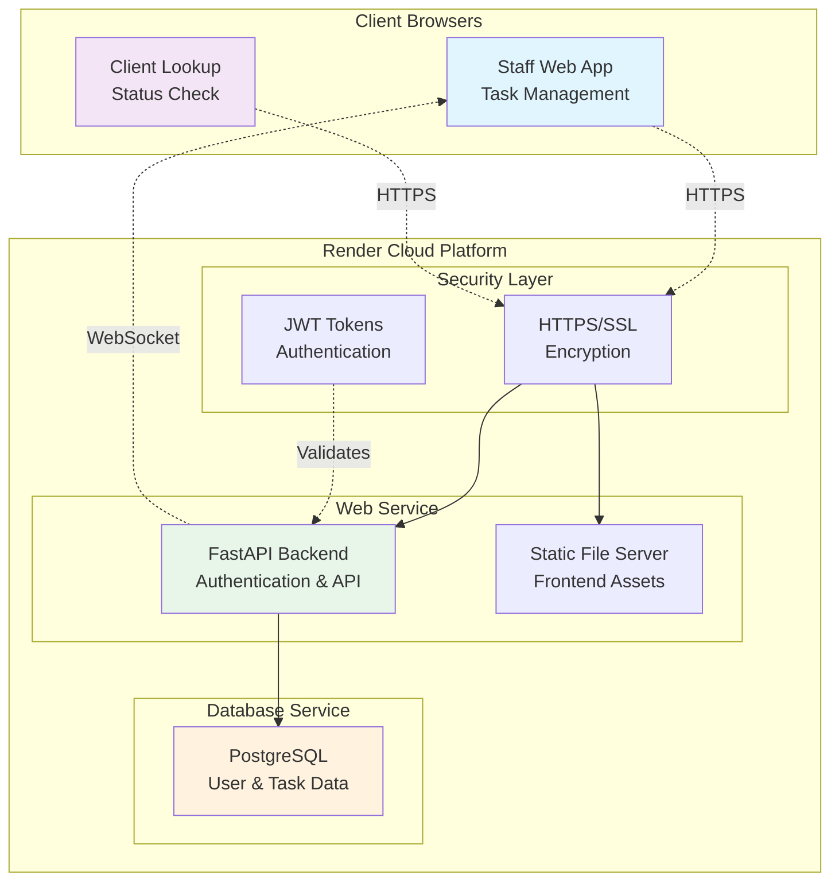
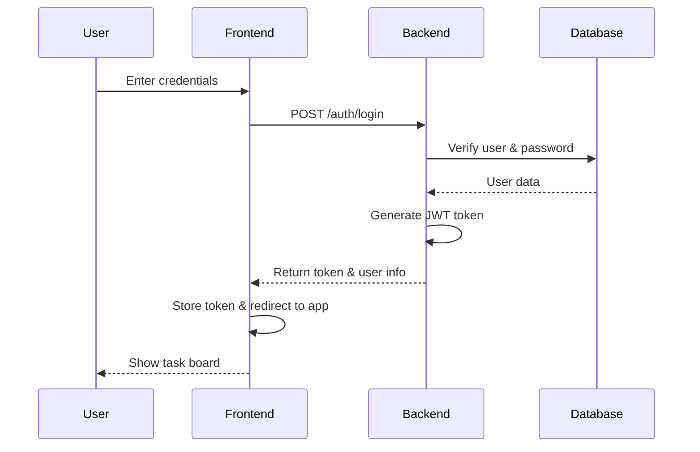
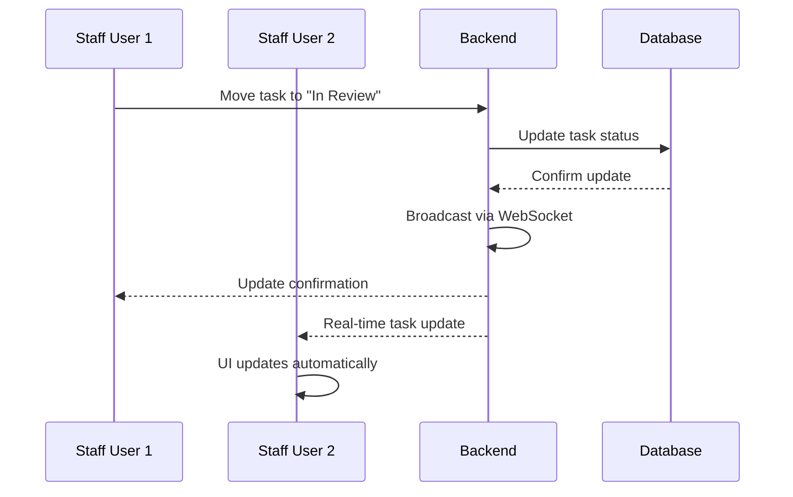
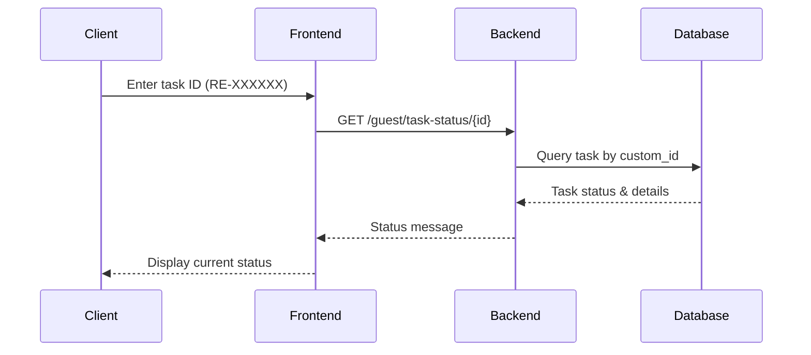
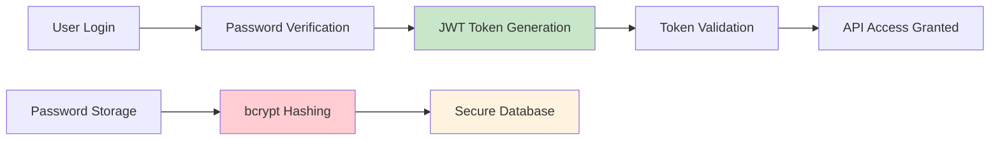
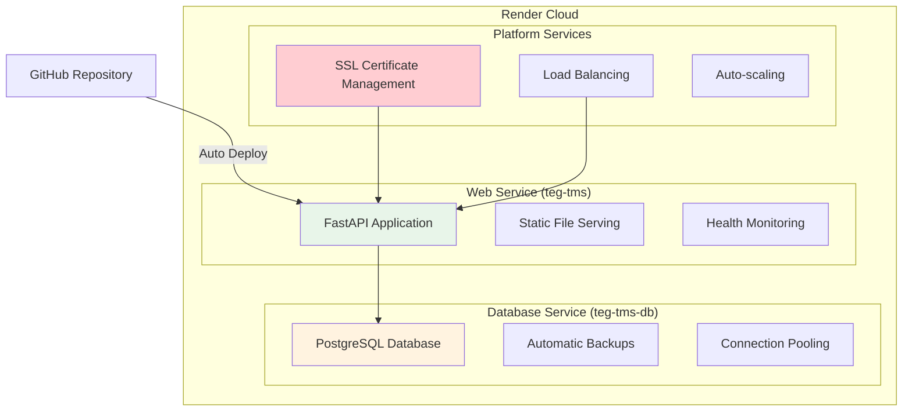

# TEG Task Management System - Architecture Documentation

## Table of Contents
- [System Overview](#system-overview)
- [Technology Stack](#technology-stack)
- [System Architecture](#system-architecture)
- [Component Overview](#component-overview)
- [Data Flow](#data-flow)
- [User Experience](#user-experience)
- [Security & Authentication](#security--authentication)
- [Deployment Architecture](#deployment-architecture)

## System Overview

The TEG Task Management System is a modern web application designed for managing real estate processing workflows at The Entrust Group. It provides a collaborative Kanban-style interface with real-time updates, user authentication, and client self-service capabilities.

### Key Features
- **Multi-user Collaboration**: Real-time task updates across all connected users
- **Role-based Access**: Admin, Active Users, and Read-only User permissions
- **Real Estate Workflows**: Specialized for BDL, SDL, nBDL, nPO task types
- **Client Self-Service**: Public task status lookup without login required
- **Professional Deployment**: Production-ready with automatic backups and SSL

## Technology Stack

### Production Stack
- **Frontend**: Modern JavaScript, HTML5, CSS3
- **Backend**: FastAPI (Python) with async support
- **Database**: PostgreSQL with automatic backups
- **Hosting**: Render Cloud Platform
- **Security**: JWT authentication, HTTPS, bcrypt password hashing

### Key Benefits
- **Scalable**: Cloud-native architecture supports growth
- **Reliable**: Production database with automatic backups
- **Secure**: Industry-standard authentication and encryption
- **Fast**: Real-time updates via WebSocket connections

## System Architecture

## Component Overview

### Frontend Components

#### **Staff Interface** (`frontend/index.html` & `frontend/script.js`)
- **Purpose**: Main task management interface for staff members
- **Features**: Drag-and-drop Kanban board, real-time updates, task creation/editing
- **Users**: All authenticated staff (Admin, Active, Inactive users)

#### **Client Lookup** (`frontend/guest-lookup.html` & `frontend/guest-lookup.js`)
- **Purpose**: Public task status checking for clients
- **Features**: Simple search by task ID, no login required
- **Users**: Clients and external parties

### Backend Components

#### **Authentication System** (`backend/routers/auth.py`)
- **Purpose**: User login, session management, security
- **Features**: JWT tokens, password hashing, role-based permissions
- **Security**: bcrypt password hashing, secure session management

#### **Task Management** (`backend/routers/tasks.py`)
- **Purpose**: Core task operations (create, read, update, delete, move)
- **Features**: Permission checking, task validation, status updates
- **Integration**: Real-time WebSocket notifications

#### **WebSocket Manager** (`backend/websocket_manager.py`)
- **Purpose**: Real-time communication between users
- **Features**: Live task updates, user notifications, connection management
- **Benefits**: Instant collaboration without page refreshes

#### **Guest Services** (`backend/routers/guest.py`)
- **Purpose**: Public API for client task lookup
- **Features**: Task status by ID, no authentication required
- **Security**: Read-only access, rate limiting

### Database Design

#### **Users Table**
- User accounts with roles (Admin, Active, Inactive)
- Secure password storage with bcrypt
- Full name, email, and permission settings

#### **Tasks Table**
- Task details (client, type, address, priority)
- Workflow status tracking (To Do → In Review → Awaiting Documents → Done)
- Custom ID generation (RE-XXXXXX format)
- Audit timestamps and ownership

#### **Session Management**
- JWT token validation
- Session tracking and security
- User activity monitoring

## Data Flow

### User Authentication Flow

### Real-time Task Updates

### Client Task Lookup

## User Experience

### Staff Workflow
1. **Login**: Secure authentication with role-based access
2. **Dashboard**: View all tasks organized by workflow stage
3. **Task Management**: Create, edit, move, and delete tasks
4. **Collaboration**: See real-time updates from other team members
5. **Client Communication**: Share task IDs for client status checking

### Client Experience
1. **Access**: Visit public lookup page (no account needed)
2. **Search**: Enter task ID received from staff
3. **Status**: View current workflow stage and details
4. **Updates**: Return anytime to check progress

### Permission Levels
- **Admin**: Full system access, user management capabilities
- **Active Users**: Create, edit, move, and delete tasks
- **Inactive Users**: View-only access to all tasks
- **Guests/Clients**: Public task status lookup only

## Security & Authentication

### Authentication Security

### Security Features
- **HTTPS Only**: All communication encrypted in transit
- **JWT Tokens**: Secure, stateless session management
- **bcrypt Hashing**: Industry-standard password protection
- **Role-based Access**: Granular permission control
- **Input Validation**: Prevents injection attacks and data corruption

### Data Protection
- **Database Backups**: Automatic daily backups via Render
- **Access Logs**: Track user activity and API usage
- **Environment Variables**: Secure configuration management
- **CORS Policy**: Controlled cross-origin requests

## Deployment Architecture

### Render Platform Services

### Deployment Process
1. **Code Push**: Developers push changes to GitHub main branch
2. **Auto Deploy**: Render detects changes and starts deployment
3. **Build Process**: Install dependencies and prepare application
4. **Health Check**: Verify application and database connectivity
5. **Go Live**: Switch traffic to new deployment
6. **Monitoring**: Continuous health monitoring and logging

### Production Benefits
- **Zero Downtime**: Rolling deployments with health checks
- **Automatic Scaling**: Handles traffic spikes automatically
- **Monitoring**: Real-time performance and error tracking
- **Backups**: Daily database backups with point-in-time recovery
- **SSL**: Automatic certificate management and renewal

---

## Monitoring & Maintenance

### Health Monitoring
- **Application Health**: `/api/v1/health` endpoint for system status
- **Database Health**: Connection and query performance monitoring
- **User Activity**: Track login patterns and usage statistics

### Performance Optimization
- **Database Indexing**: Optimized queries for task retrieval
- **WebSocket Management**: Efficient real-time connection handling
- **Static File Caching**: Optimized frontend asset delivery
- **Connection Pooling**: Efficient database resource usage

### Maintenance Tasks
- **User Management**: Add/remove users via database scripts
- **Database Cleanup**: Archive old completed tasks
- **Security Updates**: Regular dependency updates
- **Performance Monitoring**: Track response times and resource usage

## Future Enhancements

### Planned Features
- **User Management UI**: Web interface for admin user management
- **Advanced Reporting**: Task completion analytics and dashboards
- **Email Notifications**: Automated status updates to clients
- **Mobile Application**: Native mobile app for field staff
- **Document Management**: File upload and attachment support

### Scalability Improvements
- **Caching Layer**: Redis for improved performance
- **CDN Integration**: Faster global content delivery
- **Database Optimization**: Advanced indexing and query optimization
- **Multi-region Deployment**: Geographic distribution for better performance