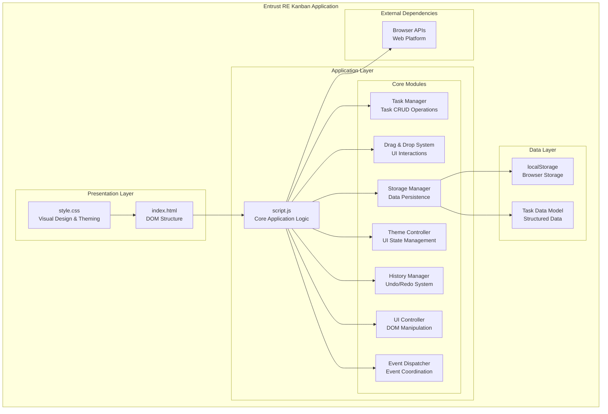
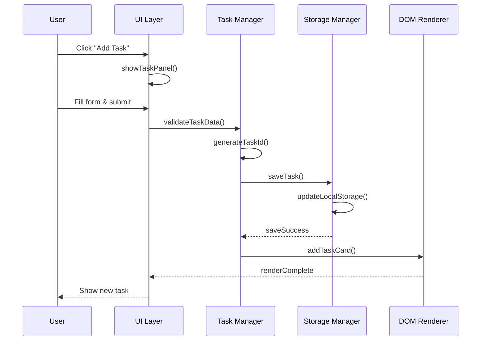
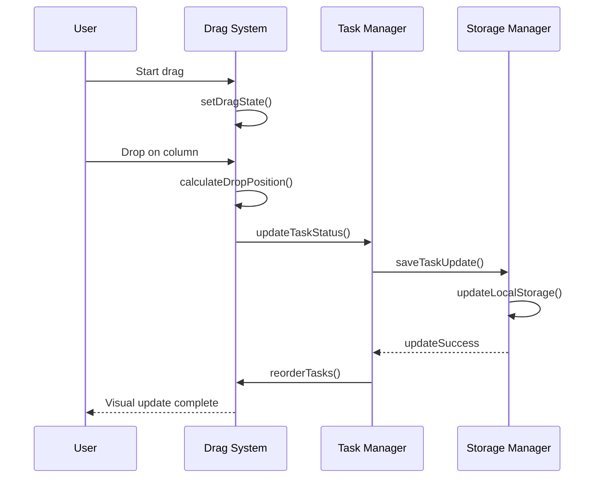

# Entrust RE Kanban Board - Architecture Documentation

## Table of Contents
- [System Overview](#system-overview)
- [Technology Stack](#technology-stack)
- [Application Architecture](#application-architecture)
- [Component Breakdown](#component-breakdown)
- [Data Flow](#data-flow)
- [Data Models](#data-models)
- [Storage Strategy](#storage-strategy)
- [Event System](#event-system)
- [UI Architecture](#ui-architecture)
- [Performance Considerations](#performance-considerations)
- [Security & Data Integrity](#security--data-integrity)

## System Overview

The Entrust RE Kanban Board is a client-side web application designed for managing real estate processing tasks. It implements a traditional Kanban workflow with four columns (To Do, In Review, Awaiting Documents, Done) and supports specialized task types relevant to real estate operations.

### Key Features
- **Real Estate Task Types**: BDL, SDL, nBDL, nPO, and Misc categories
- **Priority Processing**: Normal and Expedited task handling
- **Drag & Drop Interface**: Intuitive task movement between workflow stages
- **Persistent Storage**: Local data persistence using browser localStorage
- **Theme System**: Light/Dark mode with CSS custom properties
- **History Management**: Undo/Redo functionality for task deletions
- **Responsive Design**: Optimized for desktop and tablet usage

## Technology Stack

### Frontend Technologies
- **HTML5**: Semantic markup with accessibility considerations
- **CSS3**: Modern CSS with custom properties, flexbox, and animations
- **Vanilla JavaScript (ES6+)**: No external dependencies for core functionality
- **Local Storage API**: Client-side data persistence

### Development Approach
- **Progressive Enhancement**: Core functionality works without JavaScript
- **Component-Based Architecture**: Modular code organization
- **Event-Driven Design**: Loose coupling through event delegation

## Application Architecture



## Component Breakdown

### 1. Task Management System

**Responsibilities:**
- Task creation, updating, and deletion
- Task validation and data integrity
- Status management across workflow columns
- Priority handling (expedited vs normal processing)

**Key Functions:**
- [`addTaskCard()`](kanban-board/script.js:295) - Creates and renders task elements
- [`showTaskPanel()`](kanban-board/script.js:135) - Manages task creation/editing UI
- [`updateTaskStatus()`](kanban-board/script.js:84) - Handles workflow transitions

### 2. Drag & Drop System

**Responsibilities:**
- Drag event handling and visual feedback
- Drop zone validation and positioning
- Task reordering within columns
- Cross-column task movement

**Key Functions:**
- [`getDragAfterElement()`](kanban-board/script.js:422) - Determines drop position
- Event listeners for `dragstart`, `dragover`, `drop` events
- Visual state management during drag operations

### 3. Storage Management

**Responsibilities:**
- Data serialization/deserialization
- localStorage interaction
- Data migration and versioning
- Backup and recovery operations

**Storage Schema:**
```javascript
// localStorage key: 'allTasks'
[
  {
    id: "uuid-string",
    clientName: "Client Name",
    type: "BDL|SDL|nBDL|nPO|Misc|Misc - CustomType",
    address: "Optional address",
    processing: "normal|expedited",
    status: "todo|in-review|awaiting-documents|done",
    createdAt: timestamp
  }
]
```

### 4. Theme System

**Responsibilities:**
- Theme preference persistence
- CSS custom property management
- UI state synchronization

**Implementation:**
- CSS custom properties for color theming
- localStorage preference storage
- Automatic theme application on load

### 5. History Management

**Responsibilities:**
- Deletion tracking for undo functionality
- State restoration for redo operations
- History stack management

**Data Structures:**
```javascript
const deletedTasks = []; // Undo stack
const restoredTasks = []; // Redo stack
```

## Data Flow

### Task Creation Flow


### Drag & Drop Flow


## Data Models

### Task Model
```typescript
interface Task {
  id: string;                    // UUID v4
  clientName: string;            // Required, client identifier
  type: TaskType;               // BDL, SDL, nBDL, nPO, or Misc variants
  address?: string;             // Optional property address
  processing: 'normal' | 'expedited';
  status: 'todo' | 'in-review' | 'awaiting-documents' | 'done';
  createdAt: number;            // Unix timestamp
}

type TaskType = 'BDL' | 'SDL' | 'nBDL' | 'nPO' | 'Misc' | `Misc - ${string}`;
```

### Storage Structure
```javascript
// localStorage keys and their data types
{
  'allTasks': Task[],           // Primary task storage
  'theme': 'light' | 'dark'     // Theme preference
}
```

## Storage Strategy

### Data Persistence
- **Primary Storage**: Browser localStorage for task data
- **Backup Strategy**: Data redundancy through task array structure
- **Migration**: Version-aware data structure updates

### Performance Optimizations
- **Lazy Loading**: Tasks rendered on demand
- **Batch Operations**: Multiple task updates in single localStorage write
- **Memory Management**: Efficient DOM element reuse

### Data Integrity
- **Validation**: Client-side input validation before storage
- **Normalization**: Consistent data format enforcement
- **Recovery**: Graceful handling of corrupted data

## Event System

### Event Delegation Pattern
```javascript
// Central event handling for task operations
document.addEventListener('click', (event) => {
  if (event.target.matches('.edit-task-btn')) {
    handleTaskEdit(event);
  } else if (event.target.matches('.delete-task-btn')) {
    handleTaskDelete(event);
  }
});
```

### Drag & Drop Events
- **dragstart**: Initialize drag state and visual feedback
- **dragover**: Continuous position calculation and visual updates
- **drop**: Finalize task movement and update storage

### Custom Events
- Task state changes trigger custom events for loose coupling
- Theme changes broadcast to all listening components

## UI Architecture

### CSS Architecture
```css
:root {
  /* CSS Custom Properties for theming */
  --bg-color: #e8f5e9;
  --text-color: #2e7d32;
  --column-bg: #f0f8f0;
  /* ... additional theme variables */
}

[data-theme="dark"] {
  /* Dark theme overrides */
  --bg-color: #121212;
  --text-color: #ffffff;
  /* ... dark theme variables */
}
```

### Component Styling Strategy
- **Modular CSS**: Component-specific style blocks
- **Theme Variables**: Consistent color scheme through custom properties
- **Responsive Design**: Flexible layouts with CSS Grid and Flexbox

### Animation & Interactions
- **Smooth Transitions**: 0.3s ease-in-out for state changes
- **Visual Feedback**: Hover states and drag indicators
- **Accessibility**: Focus management and keyboard navigation

## Performance Considerations

### DOM Optimization
- **Virtual Scrolling**: Large task lists handled efficiently
- **Event Delegation**: Single event listeners for multiple elements
- **Minimal Reflows**: Batch DOM updates to prevent layout thrashing

### Memory Management
- **Object Pooling**: Reuse task DOM elements where possible
- **Cleanup**: Remove event listeners on element destruction
- **Storage Limits**: Monitor localStorage usage and implement cleanup

### Rendering Performance
- **Request Animation Frame**: Smooth drag & drop animations
- **Debounced Operations**: Limit high-frequency events
- **Progressive Enhancement**: Core functionality without JavaScript

## Security & Data Integrity

### Client-Side Security
- **Input Sanitization**: XSS prevention through proper escaping
- **Data Validation**: Type checking and format validation
- **Storage Encryption**: Consider implementing encryption for sensitive data

### Error Handling
```javascript
try {
  localStorage.setItem('allTasks', JSON.stringify(tasks));
} catch (error) {
  // Handle storage quota exceeded
  handleStorageError(error);
}
```

### Data Recovery
- **Graceful Degradation**: Application functions with corrupted data
- **Data Validation**: Runtime checks for data integrity
- **Backup Mechanisms**: Export/import functionality for data portability

---

## Development Guidelines

### Code Organization
- **Modular Functions**: Single responsibility principle
- **Clear Naming**: Descriptive function and variable names
- **Documentation**: Inline comments for complex logic

### Testing Considerations
- **Manual Testing**: Cross-browser compatibility verification
- **Data Scenarios**: Test with various task configurations
- **Edge Cases**: Handle storage failures and corrupted data

### Future Enhancements
- **Backend Integration**: RESTful API for server-side persistence
- **Real-time Collaboration**: WebSocket integration for multi-user support
- **Advanced Filtering**: Search and filter capabilities
- **Analytics Dashboard**: Task completion metrics and reporting